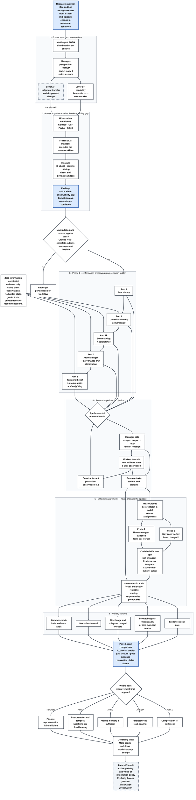

# Experiment Flowchart

```mermaid
%%{init: {
  "theme": "base",
  "themeVariables": {
    "fontSize": "22px",
    "fontFamily": "Arial, sans-serif",
    "background": "#ffffff",
    "primaryColor": "#ffffff",
    "textColor": "#000000",
    "primaryTextColor": "#000000",
    "secondaryTextColor": "#000000",
    "tertiaryTextColor": "#000000",
    "primaryBorderColor": "#1f2937",
    "lineColor": "#1f2937",
    "secondaryColor": "#eef4ff",
    "tertiaryColor": "#f8fafc",
    "clusterBkg": "#f8fafc",
    "clusterBorder": "#475569",
    "edgeLabelBackground": "#ffffff"
  },
  "themeCSS": "text, .nodeLabel, .edgeLabel, .cluster-label { color: #000000 !important; fill: #000000 !important; font-weight: 700 !important; }",
  "flowchart": {
    "curve": "basis",
    "nodeSpacing": 45,
    "rankSpacing": 65,
    "htmlLabels": false
  }
}}%%
flowchart TB
    RQ["Research question<br/><b>Can an LLM manager recover from a silent<br/>mid-episode change in teammate behavior?</b>"]

    subgraph SETUP["1 · Formal setup and interventions"]
        direction LR
        POSG["Multi-agent POSG<br/>Fixed worker co-policies"]
        POMDP["Manager-perspective POMDP<br/>Hidden mode θ switches once"]
        LB["Lever B · capability<br/>Percentile → z-score worker"]
        LA["Lever A · judgment transfer<br/>Model + prompt change"]
        POSG --> POMDP
        POMDP --> LB
        POMDP --> LA
    end

    RQ --> POSG

    subgraph PHASE1["2 · Phase 1 — characterize the observability gap"]
        direction LR
        OBS["Observation conditions<br/>Control · Full · Partial · Silent"]
        RUN1["Frozen LLM manager<br/>executes the same workflow"]
        M1["Measure<br/>R_check · routing · timing<br/>direct and downstream loss"]
        FIND["Findings<br/>Full − Silent observability gap<br/>Completion-as-competence conflation"]
        OBS --> RUN1 --> M1 --> FIND
    end

    LB --> OBS
    LA -. "transfer cell" .-> OBS

    GATE{"Manipulation and recovery gates pass?<br/>Graded loss · complete outputs · reassignment feasible"}
    FIND --> GATE
    GATE -- "No" --> REDESIGN["Redesign perturbation or workflow"]
    GATE -- "Yes" --> PHASE2

    subgraph PHASE2["3 · Phase 2 — information-preserving representation ladder"]
        direction LR
        A0["Arm 0<br/>Raw history"]
        A1["Arm 1<br/>Generic summary<br/><i>compression</i>"]
        A1P["Arm 1P<br/>Summary log<br/><i>+ persistence</i>"]
        A2["Arm 2<br/>Atomic ledger<br/><i>+ provenance and atomization</i>"]
        A3["Arm 3<br/>Temporal belief<br/><i>+ interpretation and weighting</i>"]
        A0 --> A1 --> A1P --> A2 --> A3
    end

    ZERO["<b>Zero-information constraint</b><br/>Aids use only native silent observations.<br/>No hidden state, grader truth, private traces or recommendations."]
    ZERO --> A1
    ZERO --> A1P
    ZERO --> A2
    ZERO --> A3

    subgraph PIPELINE["4 · Per-arm experimental pipeline"]
        direction LR
        PRE["Construct exact<br/>pre-action observation o_t"]
        AID{"Apply selected<br/>observation aid"}
        ACT["Manager acts<br/>assign · inspect · retry<br/>refine · reassign"]
        WORK["Workers execute<br/>New artifacts enter<br/>a later observation"]
        SAVE["Save contexts,<br/>actions and artifacts"]
        PRE --> AID --> ACT --> WORK --> PRE
        ACT --> SAVE
        WORK --> SAVE
    end

    A0 --> AID
    A1 --> AID
    A1P --> AID
    A2 --> AID
    A3 --> AID

    subgraph OFFLINE["5 · Offline measurement — never changes the episode"]
        direction LR
        POINTS["Frozen points<br/>Before Batch B and C<br/>robust assignments"]
        Q1["Probe 1<br/>May each worker<br/>have changed?"]
        Q2["Probe 2<br/>Three strongest evidence<br/>items per worker"]
        CODE["Code belief/action split<br/>Not engaged · Evidence not integrated<br/>Stated only · Belief + action"]
        AUDIT["Deterministic audit<br/>Recall and delay · relations<br/>routing opportunities · prompt size"]
        POINTS --> Q1 --> CODE
        POINTS --> Q2 --> CODE
        CODE --> AUDIT
    end

    SAVE --> POINTS
    SAVE --> AUDIT

    subgraph CONTROLS["6 · Validity controls"]
        direction LR
        C1["Evidence-recall gate"]
        C2["Prompt budgets within ±10%<br/>or size-matched control"]
        C3["No-change and<br/>noisy-unchanged workers"]
        C4["No-confession cell"]
        C5["Common-mode<br/>independence audit"]
    end

    AUDIT --> C1
    AUDIT --> C2
    AUDIT --> C3
    AUDIT --> C4
    AUDIT --> C5

    RESULTS["Paired-seed comparison<br/><b>R_check · oracle-gap closure · post-evidence correction · false alarms</b>"]
    C1 --> RESULTS
    C2 --> RESULTS
    C3 --> RESULTS
    C4 --> RESULTS
    C5 --> RESULTS

    INTERPRET{"Where does improvement first appear?"}
    RESULTS --> INTERPRET
    INTERPRET -- "Arm 1" --> I1["Compression is sufficient"]
    INTERPRET -- "Arm 1P" --> I2["Persistence is load-bearing"]
    INTERPRET -- "Arm 2" --> I3["Atomic memory is sufficient"]
    INTERPRET -- "Arm 3" --> I4["Interpretation and temporal<br/>weighting are load-bearing"]
    INTERPRET -- "Nowhere" --> I5["Passive representation<br/>is insufficient"]

    TRANSFER["Generality tests<br/>More seeds · workflows · model+prompt change"]
    I1 --> TRANSFER
    I2 --> TRANSFER
    I3 --> TRANSFER
    I4 --> TRANSFER
    I5 --> TRANSFER

    FUTURE["Future Phase 3<br/>Active probing and value-of-information policy<br/><i>Explicitly breaks passive information preservation</i>"]
    TRANSFER --> FUTURE

    classDef default fill:#ffffff,stroke:#1f2937,stroke-width:2.5px,color:#000000,font-size:22px,font-weight:700;
    classDef emphasis fill:#dbeafe,stroke:#174ea6,stroke-width:3px,color:#000000,font-weight:700;
    classDef future fill:#f1f5f9,stroke:#475569,stroke-width:2.5px,stroke-dasharray:8 5,color:#000000,font-weight:700;
    class RQ,FIND,RESULTS emphasis;
    class LA,FUTURE future;
    linkStyle default stroke:#1f2937,stroke-width:3px;
```
